# ZENDA Shop

## 👥 Miembros del Equipo
| Nombre y Apellidos | Correo URJC | Usuario GitHub |
|:--- |:--- |:--- |
| Samuel Melián Benito | s.melian.2022@alumnos.urjc.es | SamuelMelian |
| Víctor Navarro Santos | v.navarros.2022@alumnos.urjc.es | victor04san7os |
| Alejandro Lefebvre Valiente | a.lefebvre.2022@alumnos.urjc.es | LBV6 |
| Jorge Padilla Rodríguez | j.padilla.2021@alumnos.urjc.es | Jorge-PR |
| Sara Guillén Martínez | s.guillenm.2022@alumnos.urjc.es | saraguillenmtz |

---

## 🎭 **Preparación 1: Definición del Proyecto**

### **Descripción del Tema**
La aplicación web pertenece al sector del comercio electrónico de moda y está orientada a la venta online de ropa. Permite a los usuarios explorar un catálogo de prendas, gestionar un carrito de compra (pedido en progreso), realizar pedidos y dejar opiniones sobre los productos adquiridos. Como valor añadido, la aplicación ofrece estadísticas de ventas e ingresos. Aporta valor al usuario ofreciendo una experiencia de compra sencilla y personalizada, con facturación automática en PDF y recomendaciones basadas en sus preferencias de compra.


### **Entidades**
1. **Usuario**: cliente registrado que navega, compra y opina en la plataforma.  
2. **Prenda**: producto de ropa disponible en el catálogo.  
3. **Pedido**: registro de una compra realizada por un usuario, que incluye una o varias prendas y almacena la información necesaria para la facturación.
4. **Opinión**: valoración y comentario de un usuario sobre una prenda.


**Relaciones entre entidades:**
- **Usuario - Pedido:** un usuario puede realizar múltiples pedidos (**1:N**).  
- **Pedido - Prenda:** un pedido puede contener múltiples prendas y una prenda puede aparecer en múltiples pedidos (**N:M**).  
- **Usuario - Opinión:** un usuario puede escribir múltiples opiniones (**1:N**).  
- **Prenda - Opinión:** una prenda puede recibir múltiples opiniones (**1:N**).

### **Permisos de los Usuarios**
Describir los permisos de cada tipo de usuario e indicar de qué entidades es dueño:

* **Usuario Anónimo**:  
  - **Permisos:** visualización del catálogo de prendas, búsqueda y filtrado de productos, registro en la plataforma.  
  - **Propiedad:** no es dueño de ninguna entidad.

* **Usuario Registrado**:  
  - **Permisos:** gestión de su perfil, edición de pedido (en estado en progreso = "carrito"), realización de pedidos, generación y descarga de facturas en PDF para un pedido realizado, creación y edición de opiniones sobre prendas adquiridas.  
  - **Propiedad:** su perfil de usuario, su pedido en progreso y sus opiniones.

* **Administrador**:  
  - **Permisos:** gestión completa (CRUD) de usuarios, prendas, pedidos (en estado realizado) y opiniones, visualización de estadísticas de ventas e ingresos.  
  - **Propiedad:** es dueño de las prendas y los pedidos realizados.


### **Imágenes**
Indicar qué entidades tendrán asociadas una o varias imágenes:

- **Usuario**: una imagen de avatar opcional por usuario.
- **Prenda**: una imagen por prenda para su visualización en el catálogo.


### **Gráficos**
Indicar qué información se mostrará usando gráficos y de qué tipo serán:

- **Gráfico 1**: número de ventas por periodo de tiempo — gráfico de barras.
- **Gráfico 2**: ingresos totales por periodo de tiempo — gráfico de líneas.
- **Gráfico 3**: valor medio de los pedidos (ticket medio) por periodo de tiempo — gráfico de líneas.


### **Tecnología Complementaria**
Indicar qué tecnología complementaria se empleará:

- **Generación de facturas en PDF** de cada pedido realizada por el usuario, incluyendo el detalle de las prendas adquiridas, precios, impuestos y datos del cliente.


### **Algoritmo o Consulta Avanzada**
Indicar cuál será el algoritmo o consulta avanzada que se implementará:

- **Algoritmo/Consulta:** generación de ofertas personalizadas para el usuario.
- **Descripción:** el sistema analiza los pedidos realizadas por el usuario durante el último mes, identifica la categoría de productos más comprada y muestra tres ofertas basadas en dicha categoría.
- **Alternativa:** consulta avanzada que agrupa los pedidos del último mes por usuario y categoría, calculando la frecuencia de pedidos para determinar la preferencia principal.

Se valorará en el momento indicado realizar una consulta más avanzada con recomendaciones personalizadas basadas en lo que compran los usuarios que más se parecen a ti.

---

## 🛠 **Preparación 2: Maquetación de páginas con HTML y CSS**

### **Vídeo de Demostración**
📹 **[Enlace al vídeo en YouTube](https://www.youtube.com/watch?v=x91MPoITQ3I)**
> Vídeo mostrando las principales funcionalidades de la aplicación web.

### **Diagrama de Navegación**
Diagrama que muestra cómo se navega entre las diferentes páginas de la aplicación:

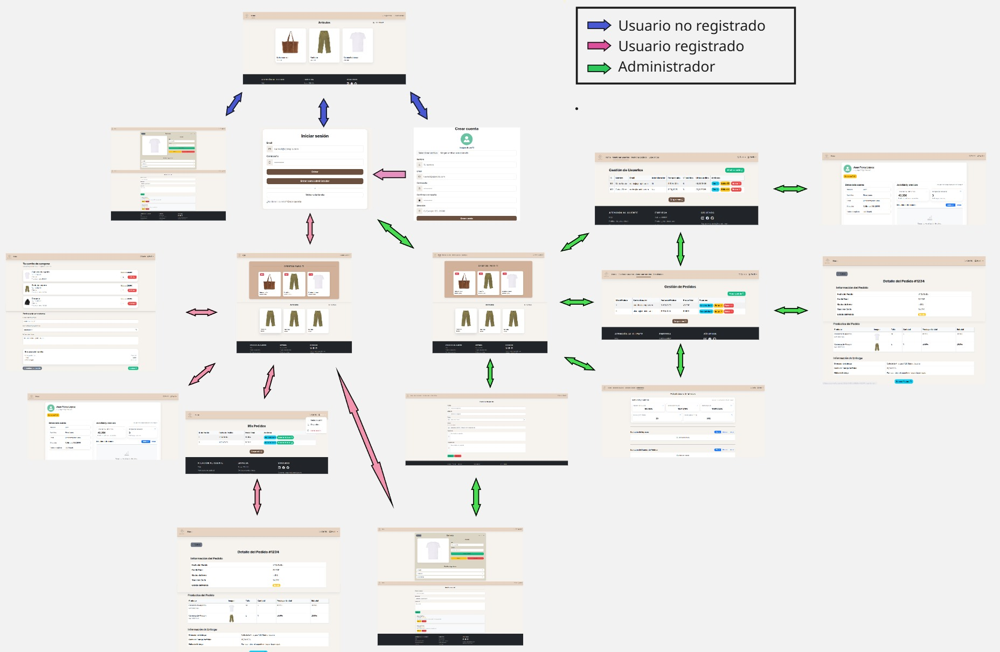

> [Descripción opcional del flujo de navegación: Ej: "El usuario puede acceder desde la página principal a todas las secciones mediante el menú de navegación. Los usuarios anónimos solo tienen acceso a las páginas públicas, mientras que los registrados pueden acceder a su perfil y panel de usuario."]

### **Capturas de Pantalla y Descripción de Páginas**

#### **1. Página Principal (usuario no registrado) **
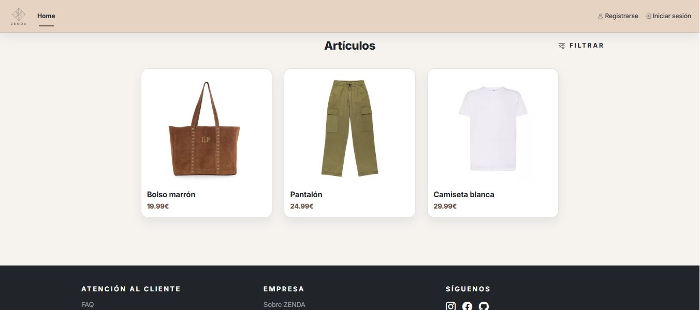
>La página principal representa el punto de inicio de la aplicación y está diseñada para ofrecer una visión clara y ordenada del catálogo de productos. Los artículos se muestran en un diseño en cuadrícula responsive, donde cada producto incluye su imagen, nombre y precio y un acceso rápido al detalle de cada prenda. En la parte superior se encuentra una barra de navegación fija que permite volver al inicio en todo momento y acceder a las opciones de registro e inicio de sesión para usuarios no autenticados. Además, se ha incorporado un sistema de filtrado desplegable que permite buscar y ordenar los productos por categoría, rango de precios o popularidad. El footer contiene enlaces informativos y acceso a redes sociales.

#### **2. Página de Registro**
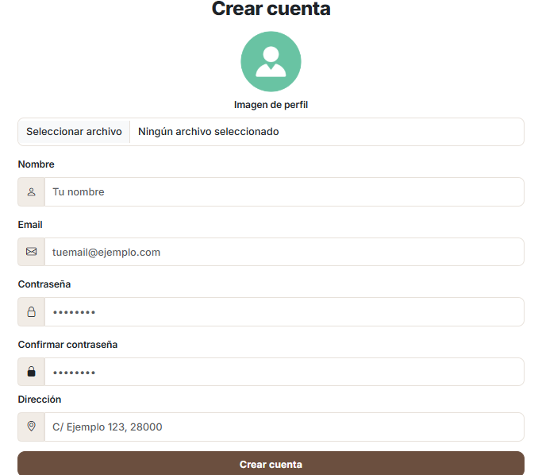

>La página de registro permite al usuario crear una cuenta mediante un formulario organizado. Incluye la opción de subir una imagen de perfil (mostrando un avatar por defecto), además de los campos principales necesarios para el alta: nombre, email, contraseña y confirmación de contraseña, junto con la dirección. Para mejorar la usabilidad, cada campo está acompañado de iconos dentro de los input-group, lo que facilita identificar rápidamente qué información se solicita. Finalmente, se ofrecen accesos directos tanto para completar el registro (“Crear cuenta”) como para volver a la tienda o ir a la pantalla de inicio de sesión si el usuario ya dispone de cuenta.

#### **3. Iniciar sesión**
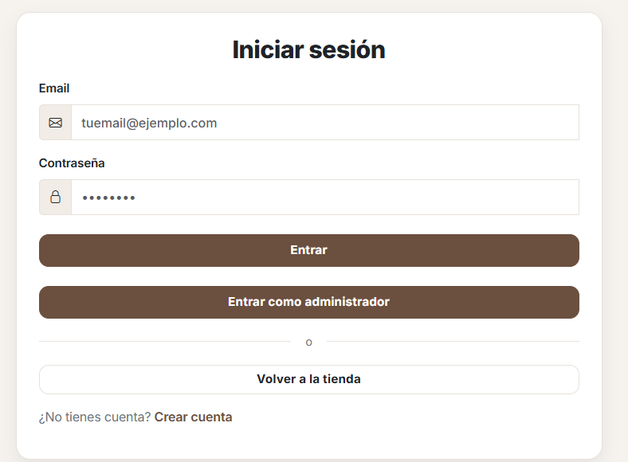

>La página de inicio de sesión permite acceder a la aplicación mediante un formulario: email y contraseña. Los campos incluyen iconos en cada input para facilitar la lectura, además de validaciones básicas (formato de email y longitud mínima de contraseña) para evitar errores comunes. Además, se incluyen dos accesos diferenciados: uno para entrar como usuario registrado y otro para entrar como administrador. Sin embargo, en la próxima práctica habrá solamente un botón de entrar y se iniciará sesión como usuario normal o administrador dependiendo de las credenciales introducidas. También se añade un enlace para volver a la tienda sin iniciar sesión y un acceso directo a la página de registro para usuarios nuevos.

#### **4. Página Principal (usuario registrado)**
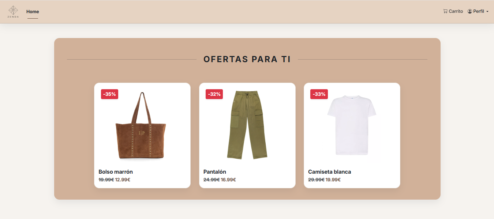
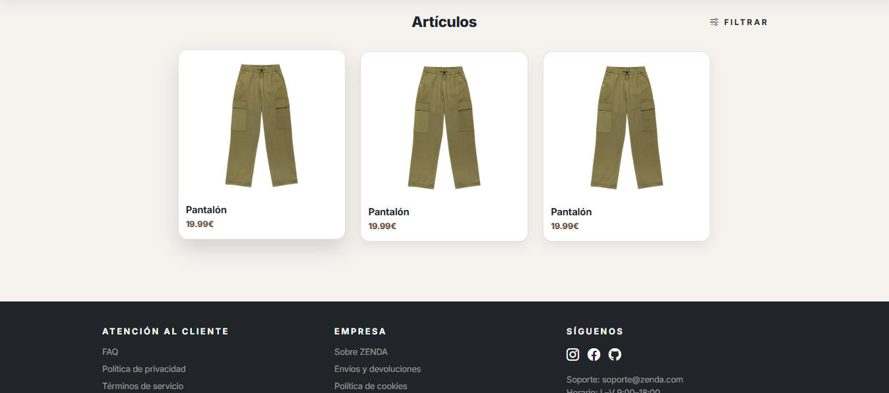

>La página principal para usuarios registrados mantiene la estructura del catálogo, pero añade funcionalidades pensadas para una experiencia más personalizada. En la barra superior se incorporan accesos directos al carrito y un menú desplegable de perfil, desde el que el usuario puede gestionar sus datos, consultar sus pedidos o cerrar sesión. Se incluye una sección de “Ofertas para ti” al inicio, apartado de recomendaciones u ofertas destacadas. A continuación, se mantiene el listado general de artículos con el mismo sistema de filtrado desplegable (búsqueda, categoría, rango de precio y ordenación). El footer conserva enlaces informativos y redes sociales.

#### **5. Página de detalle producto ofertado **
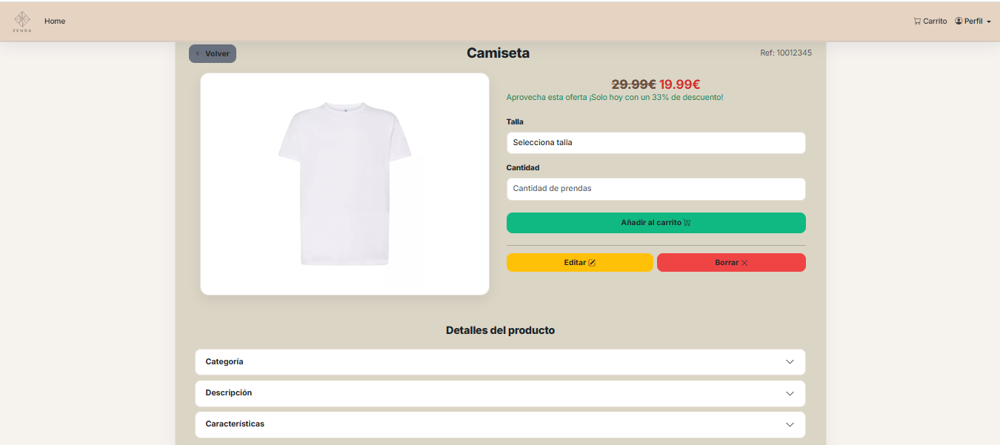
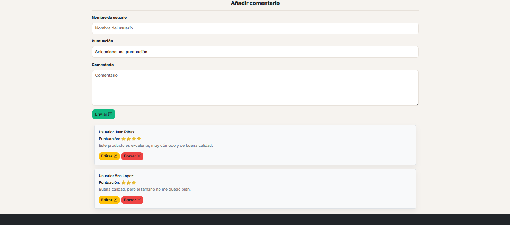

> La página de detalle muestra toda la información relevante de un producto de forma más completa para su compra. En la parte superior se mantiene la navegación del usuario registrado (home, carrito y menú de perfil) y se añade un botón de “Volver” para regresar al catálogo. El contenido principal incluye la imagen del producto, su referencia y el precio, destacando las ofertas mediante el precio tachado, el precio rebajado y un mensaje informativo del descuento. Los botones de editar y borrar serán solo visibles para el administrador. Además, se permite seleccionar talla y cantidad antes de añadir el artículo al carrito. Finalmente, se incorpora una sección de comentarios con formulario de valoración y listado de reseñas, incluyendo opciones de editar y borrar (estos dos últimos solamente también serán visibles solamente para el usuario).

#### **6. Página de Detalle de Producto (sin oferta)**

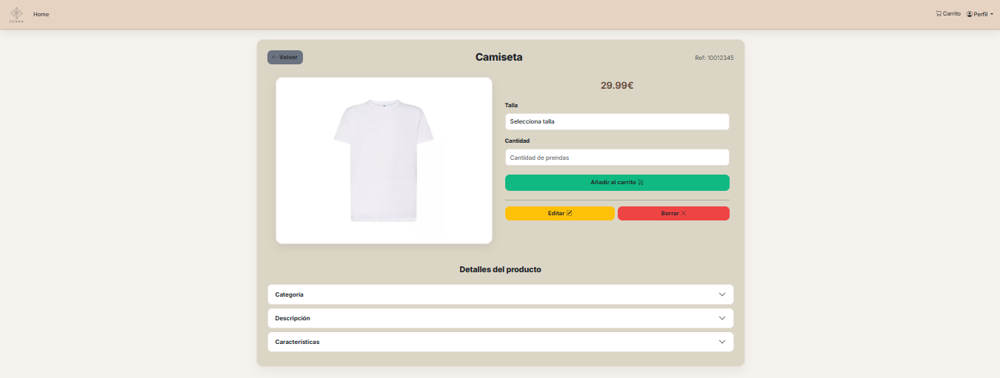
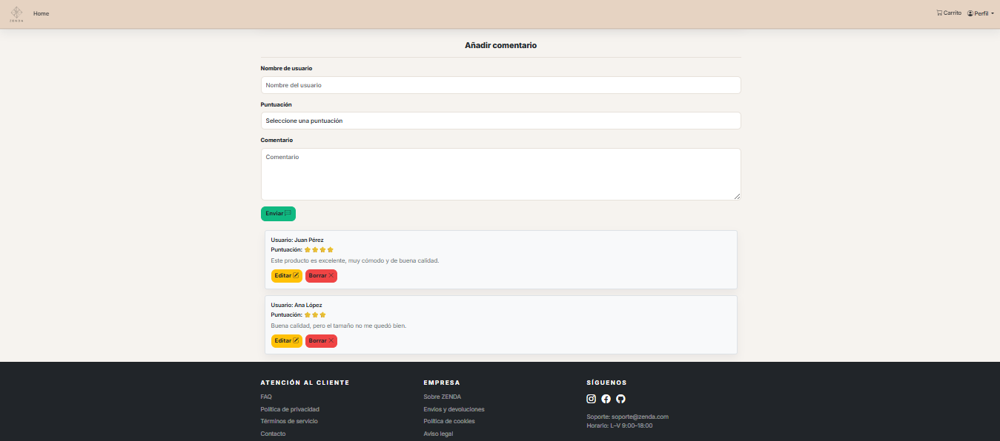

> Esta página muestra el detalle completo de un producto cuando no está en promoción, manteniendo la misma estructura de navegación para usuarios registrados(home, carrito y menú de perfil) y un botón de “Volver”, dado que los no registrados solamente podrán ver el producto y las opiniones, pero no podrán ni comprar ni añadir comentarios . En el contenido principal se presenta la imagen del artículo, su referencia y el precio normal, junto con un bloque de compra donde el usuario puede seleccionar la talla y la cantidad antes de añadir el producto al carrito. Además, se incluye un apartado de comentarios con formulario de valoración y listado de reseñas, con opciones de editar y borrar (será solo para administradores).

#### **7. Página de Añadir/Editar Prenda (Administrador)**

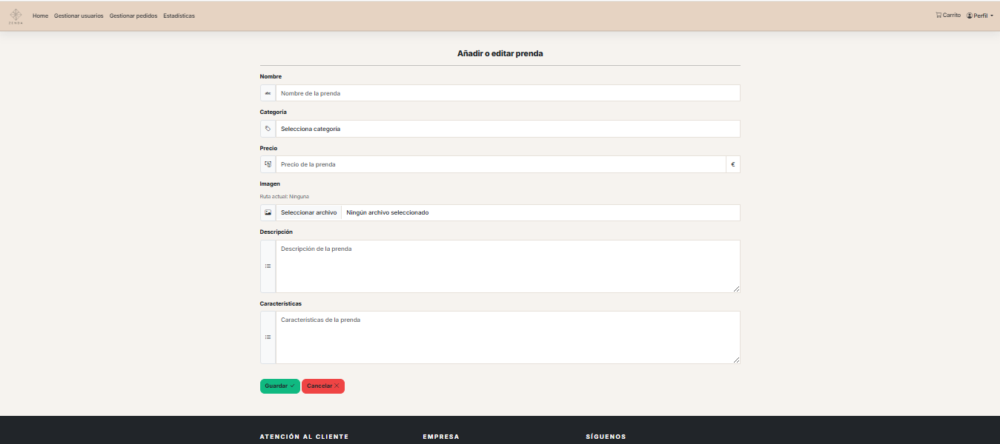


> La página de añadir o editar prenda permite al administrador gestionar el catálogo mediante un formulario . Se incluyen los campos principales de una prenda (nombre, categoría, precio, imagen, descripción y características). Cuando sea añadir estos campos aparecerán vacíos, en cambio, en editar aparecerá la información que estuviese anteriormente. Además, el formulario incorpora validaciones básicas (por ejemplo, rangos de precio y longitudes mínimas de texto) para evitar datos incorrectos . Por último, se incluyen botones de “Guardar” y “Cancelar” para completar o descartar los cambios y se mantiene la navegación y el estilo visual del panel de administración.


#### **8. Página de Carrito / Pedido en progreso**

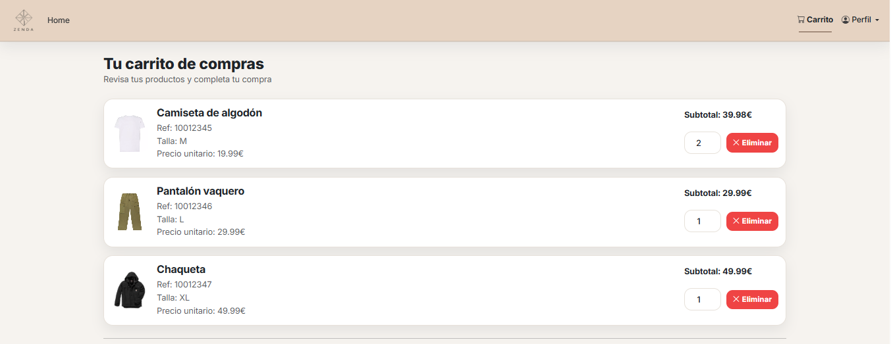
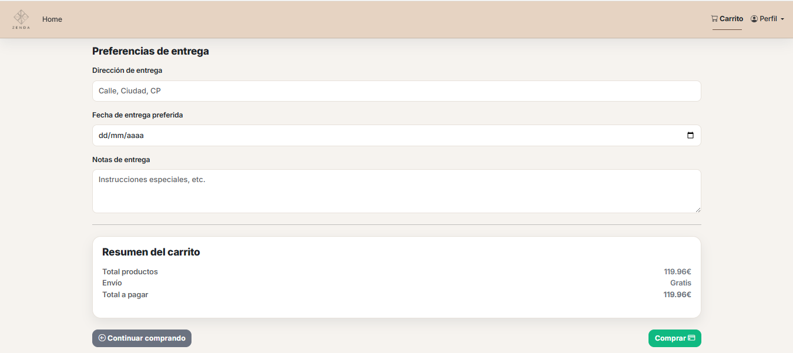

> La página de carrito permite al usuario revisar los productos añadidos antes de finalizar la compra, mostrando cada artículo con su imagen, nombre, referencia, talla, precio unitario y subtotal. Además, se incluye un control de cantidad mediante input numérico y un botón para eliminar productos. Debajo del listado se añade un apartado de preferencias de entrega donde el usuario puede indicar dirección, fecha preferida y notas de entrega. Finalmente, se presenta un resumen del carrito con el total de productos, el coste de envío y el total a pagar, junto con botones  para continuar comprando o realizar la compra.

#### **9. Página Principal (Administrador) **

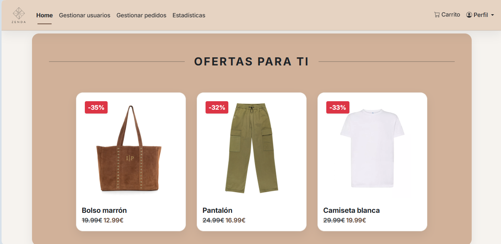
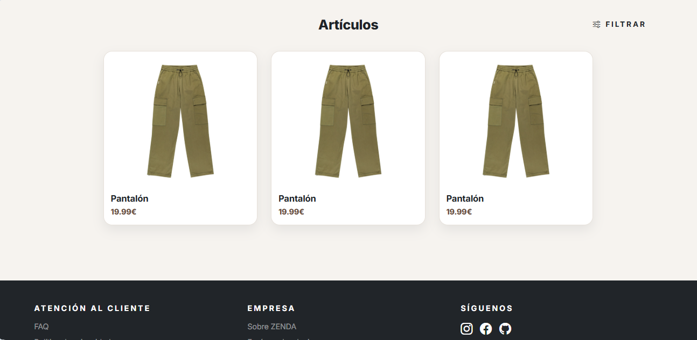

La página principal para el administrador mantiene la estructura del catálogo, pero añade opciones orientadas a la gestión de la aplicación. En la barra superior se incorporan accesos directos al carrito y un menú desplegable de perfil, y además aparece un menú específico de administración desde el que se puede navegar a la gestión de usuarios, gestión de pedidos y estadísticas. Se incluye una sección de “Ofertas para ti” al inicio, a modo de apartado de productos destacados. A continuación, se mantiene el listado general de artículos con el mismo sistema de filtrado desplegable (búsqueda, categoría, rango de precio y ordenación). El footer conserva enlaces informativos y redes sociales


#### **10. Página de Gestión de Usuarios (Administrador)**
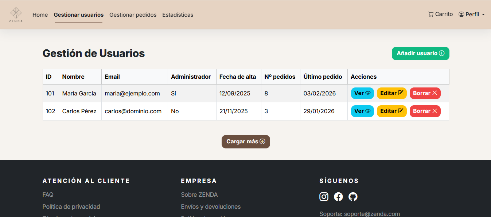

> Esta página permite al administrador gestionar los usuarios registrados. La información se presenta en una tabla responsive con los datos principales (ID, nombre, email y si es administrador) y, además, incluye campos adicionales como fecha de alta, número de pedidos y fecha del último pedido. En la parte superior se incorpora un botón para añadir un nuevo usuario y, para cada fila, se incluyen acciones claras de ver, editar y borrar. Cada vez que añadamos un usuario se nos redirigirá a una página similiar a la de registrarse, lo mismo con editar, pero con la información ya añadida. También se añade un botón de “Cargar más” para representar carga dinámica de resultados. La navegación superior específica de administrador (usuarios, pedidos y estadísticas) diferenciandolo del rol de usuario normal.

#### **11. Página de Gestión de Pedidos (Administrador)**

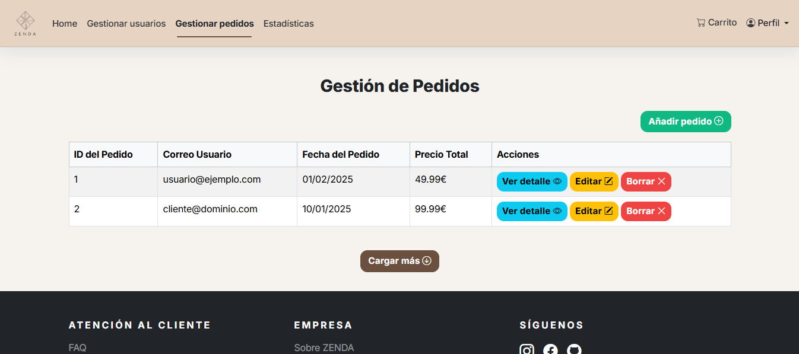

> Esta página permite al administrador gestionar los pedidos realizados . Los pedidos se muestran en una tabla responsive con los datos más importantes (ID del pedido, correo del usuario, fecha y precio total), lo que facilita localizar rápidamente compras concretas. Para cada pedido se incluyen acciones típicas de administración: ver el detalle completo, editar o borrar. Además, en la parte superior se incorpora un botón para añadir nuevos pedidos y, al final de la tabla, un botón de “Cargar más” para representar paginación. La navegación superior se mantiene específica de administrador (usuarios, pedidos y estadísticas).

#### **12. Página de Estadísticas (Administrador)**

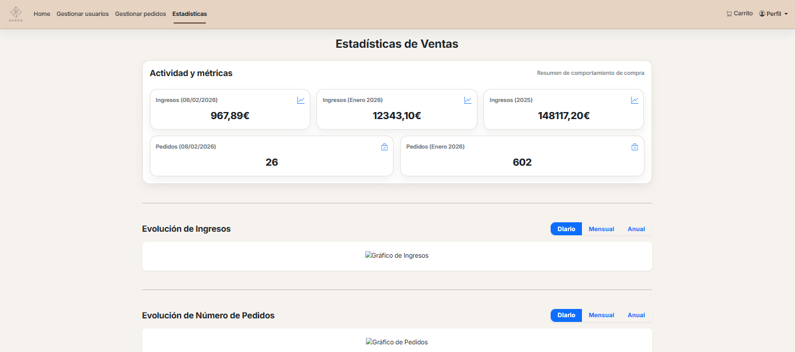

> Esta página está pensada para que el administrador pueda consultar el rendimiento de la tienda. En la parte superior se muestran métricas clave en formato de tarjetas (ingresos y número de pedidos) diferenciando distintos periodos, para tener una general sin necesidad de entrar al detalle de cada pedido. Además, se incluyen dos apartados de evolución (ingresos y número de pedidos) representados mediante gráficos, acompañados de un selector de periodo (diario, mensual o anual). La página refleja un panel de control típico de administración, manteniendo la misma navegación superior del rol administrador.

#### **13. Página de Perfil de Usuario**

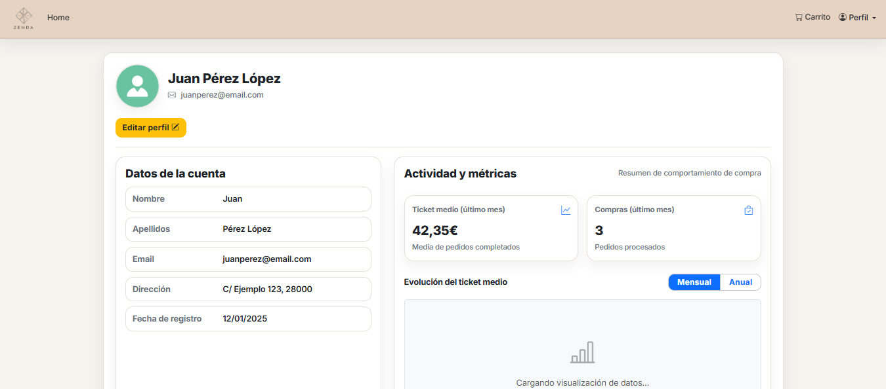

> La página de perfil permite al usuario consultar y gestionar la información de su cuenta. En la parte superior se muestra el avatar junto con el nombre y el email, y se incluye un botón de “Editar perfil” para acceder directamente a la modificación de datos. A continuación, la información se organiza en dos bloques: por un lado, los datos básicos de la cuenta (nombre, apellidos, email, dirección y fecha de registro) y, por otro, un apartado de actividad con métricas de compra como el ticket medio y el número de compras del último mes. Además, se incorpora una zona de gráfica con selector de periodo (mensual/anual) para representar la evolución del ticket medio. La página mantiene la navegación habitual del usuario registrado (home, carrito y menú de perfil).

#### **14. Página de Mis Pedidos**

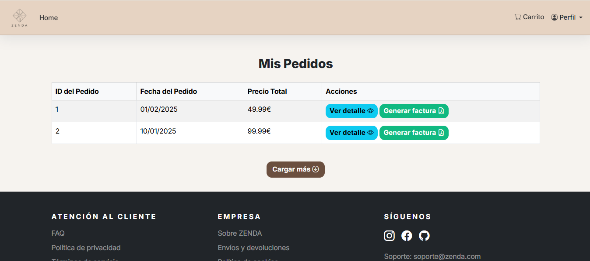

> La página de “Mis pedidos” permite al usuario consultar su historial de compras mediante una tabla con la información principal de cada pedido (ID, fecha y precio total). Para cada pedido se puede acceder al detalle completo del pedido y generar la factura en PDF. Además, se añade un botón de “Cargar más” para representar paginación de pedidos cuando el historial sea más amplio. La página mantiene la navegación habitual del usuario registrado (home, carrito y menú de perfil).

#### **15. Página de Detalle de Pedido / Información de compra**

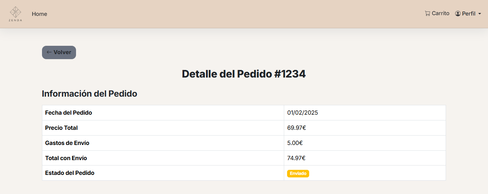
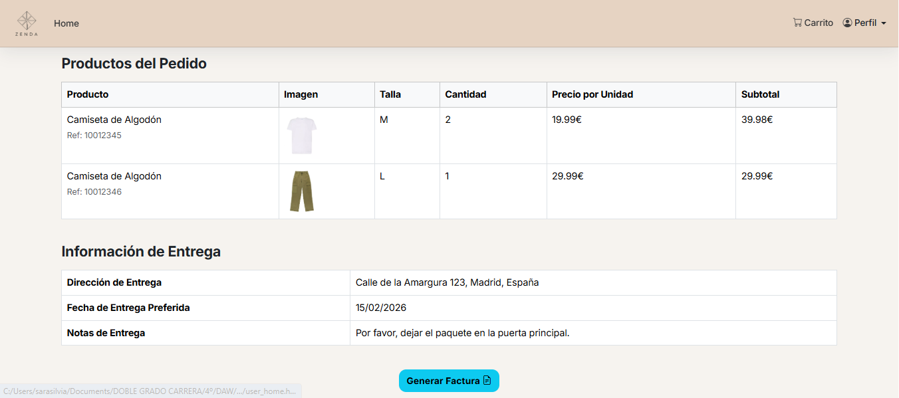

> La página de detalle de pedido permite al usuario/administrador consultar de forma completa la información de una compra concreta. Incluye un botón de “Volver” para regresar al listado de pedidos y muestra un resumen del pedido (fecha, precio total, gastos de envío, total con envío y estado). A continuación, se presenta una tabla con los productos incluidos en el pedido, indicando imagen, talla, cantidad, precio unitario y subtotal, para que el usuario pueda revisar exactamente qué ha comprado. También se añade un apartado con la información de entrega (dirección, fecha preferida y notas), completando el seguimiento del pedido. Por último, se incluye un botón para generar la factura.


## 🛠 **Práctica 1: Web con HTML generado en servidor y AJAX**

### **Vídeo de Demostración**
📹 **[Enlace al vídeo en YouTube](https://www.youtube.com/watch?v=x91MPoITQ3I)**
> Vídeo mostrando las principales funcionalidades de la aplicación web.

### **Navegación y Capturas de Pantalla**

#### **Diagrama de Navegación**

Solo si ha cambiado.

#### **Capturas de Pantalla Actualizadas**

Solo si han cambiado.

### **Instrucciones de Ejecución**

#### **Requisitos Previos**
- **Java**: versión 21 o superior
- **Maven**: versión 3.8 o superior
- **MySQL**: versión 8.0 o superior
- **Git**: para clonar el repositorio

#### **Pasos para ejecutar la aplicación**

1. **Clonar el repositorio**
   ```bash
   git clone https://github.com/[usuario]/[nombre-repositorio].git
   cd [nombre-repositorio]
   ```

2. **AQUÍ INDICAR LO SIGUIENTES PASOS**

#### **Credenciales de prueba**
- **Usuario Admin**: usuario: `admin`, contraseña: `admin`
- **Usuario Registrado**: usuario: `user`, contraseña: `user`

### **Diagrama de Entidades de Base de Datos**

Diagrama mostrando las entidades, sus campos y relaciones:


> [Descripción opcional: Ej: "El diagrama muestra las 4 entidades principales: Usuario, Producto, Pedido y Categoría, con sus respectivos atributos y relaciones 1:N y N:M."]

### **Diagrama de Clases y Templates**

Diagrama de clases de la aplicación con diferenciación por colores o secciones:


> [Descripción opcional del diagrama y relaciones principales]

### **Participación de Miembros en la Práctica 1**

#### **Alumno 1 - [Nombre Completo]**

[Descripción de las tareas y responsabilidades principales del alumno en el proyecto]

| Nº    | Commits      | Files      |
|:------------: |:------------:| :------------:|
|1| [Descripción commit 1](URL_commit_1)  | [Archivo1](URL_archivo_1)   |
|2| [Descripción commit 2](URL_commit_2)  | [Archivo2](URL_archivo_2)   |
|3| [Descripción commit 3](URL_commit_3)  | [Archivo3](URL_archivo_3)   |
|4| [Descripción commit 4](URL_commit_4)  | [Archivo4](URL_archivo_4)   |
|5| [Descripción commit 5](URL_commit_5)  | [Archivo5](URL_archivo_5)   |

---

#### **Alumno 2 - [Nombre Completo]**

[Descripción de las tareas y responsabilidades principales del alumno en el proyecto]

| Nº    | Commits      | Files      |
|:------------: |:------------:| :------------:|
|1| [Descripción commit 1](URL_commit_1)  | [Archivo1](URL_archivo_1)   |
|2| [Descripción commit 2](URL_commit_2)  | [Archivo2](URL_archivo_2)   |
|3| [Descripción commit 3](URL_commit_3)  | [Archivo3](URL_archivo_3)   |
|4| [Descripción commit 4](URL_commit_4)  | [Archivo4](URL_archivo_4)   |
|5| [Descripción commit 5](URL_commit_5)  | [Archivo5](URL_archivo_5)   |

---

#### **Alumno 3 - [Nombre Completo]**

[Descripción de las tareas y responsabilidades principales del alumno en el proyecto]

| Nº    | Commits      | Files      |
|:------------: |:------------:| :------------:|
|1| [Descripción commit 1](URL_commit_1)  | [Archivo1](URL_archivo_1)   |
|2| [Descripción commit 2](URL_commit_2)  | [Archivo2](URL_archivo_2)   |
|3| [Descripción commit 3](URL_commit_3)  | [Archivo3](URL_archivo_3)   |
|4| [Descripción commit 4](URL_commit_4)  | [Archivo4](URL_archivo_4)   |
|5| [Descripción commit 5](URL_commit_5)  | [Archivo5](URL_archivo_5)   |

---

#### **Alumno 4 - [Nombre Completo]**

[Descripción de las tareas y responsabilidades principales del alumno en el proyecto]

| Nº    | Commits      | Files      |
|:------------: |:------------:| :------------:|
|1| [Descripción commit 1](URL_commit_1)  | [Archivo1](URL_archivo_1)   |
|2| [Descripción commit 2](URL_commit_2)  | [Archivo2](URL_archivo_2)   |
|3| [Descripción commit 3](URL_commit_3)  | [Archivo3](URL_archivo_3)   |
|4| [Descripción commit 4](URL_commit_4)  | [Archivo4](URL_archivo_4)   |
|5| [Descripción commit 5](URL_commit_5)  | [Archivo5](URL_archivo_5)   |

---

## 🛠 **Práctica 2: Incorporación de una API REST a la aplicación web, despliegue con Docker y despliegue remoto**

### **Vídeo de Demostración**
📹 **[Enlace al vídeo en YouTube](https://www.youtube.com/watch?v=x91MPoITQ3I)**
> Vídeo mostrando las principales funcionalidades de la aplicación web.

### **Documentación de la API REST**

#### **Especificación OpenAPI**
📄 **[Especificación OpenAPI (YAML)](/api-docs/api-docs.yaml)**

#### **Documentación HTML**
📖 **[Documentación API REST (HTML)](https://raw.githack.com/[usuario]/[repositorio]/main/api-docs/api-docs.html)**

> La documentación de la API REST se encuentra en la carpeta `/api-docs` del repositorio. Se ha generado automáticamente con SpringDoc a partir de las anotaciones en el código Java.

### **Diagrama de Clases y Templates Actualizado**

Diagrama actualizado incluyendo los @RestController y su relación con los @Service compartidos:


### **Instrucciones de Ejecución con Docker**

#### **Requisitos previos:**
- Docker instalado (versión 20.10 o superior)
- Docker Compose instalado (versión 2.0 o superior)

#### **Pasos para ejecutar con docker-compose:**

1. **Clonar el repositorio** (si no lo has hecho ya):
   ```bash
   git clone https://github.com/[usuario]/[repositorio].git
   cd [repositorio]
   ```

2. **AQUÍ LOS SIGUIENTES PASOS**:

### **Construcción de la Imagen Docker**

#### **Requisitos:**
- Docker instalado en el sistema

#### **Pasos para construir y publicar la imagen:**

1. **Navegar al directorio de Docker**:
   ```bash
   cd docker
   ```

2. **AQUÍ LOS SIGUIENTES PASOS**

### **Despliegue en Máquina Virtual**

#### **Requisitos:**
- Acceso a la máquina virtual (SSH)
- Clave privada para autenticación
- Conexión a la red correspondiente o VPN configurada

#### **Pasos para desplegar:**

1. **Conectar a la máquina virtual**:
   ```bash
   ssh -i [ruta/a/clave.key] [usuario]@[IP-o-dominio-VM]
   ```
   
   Ejemplo:
   ```bash
   ssh -i ssh-keys/app.key vmuser@10.100.139.XXX
   ```

2. **AQUÍ LOS SIGUIENTES PASOS**:

### **URL de la Aplicación Desplegada**

🌐 **URL de acceso**: `https://[nombre-app].etsii.urjc.es:8443`

#### **Credenciales de Usuarios de Ejemplo**

| Rol | Usuario | Contraseña |
|:---|:---|:---|
| Administrador | admin | admin123 |
| Usuario Registrado | user1 | user123 |
| Usuario Registrado | user2 | user123 |

### **Participación de Miembros en la Práctica 2**

#### **Alumno 1 - [Nombre Completo]**

[Descripción de las tareas y responsabilidades principales del alumno en el proyecto]

| Nº    | Commits      | Files      |
|:------------: |:------------:| :------------:|
|1| [Descripción commit 1](URL_commit_1)  | [Archivo1](URL_archivo_1)   |
|2| [Descripción commit 2](URL_commit_2)  | [Archivo2](URL_archivo_2)   |
|3| [Descripción commit 3](URL_commit_3)  | [Archivo3](URL_archivo_3)   |
|4| [Descripción commit 4](URL_commit_4)  | [Archivo4](URL_archivo_4)   |
|5| [Descripción commit 5](URL_commit_5)  | [Archivo5](URL_archivo_5)   |

---

#### **Alumno 2 - [Nombre Completo]**

[Descripción de las tareas y responsabilidades principales del alumno en el proyecto]

| Nº    | Commits      | Files      |
|:------------: |:------------:| :------------:|
|1| [Descripción commit 1](URL_commit_1)  | [Archivo1](URL_archivo_1)   |
|2| [Descripción commit 2](URL_commit_2)  | [Archivo2](URL_archivo_2)   |
|3| [Descripción commit 3](URL_commit_3)  | [Archivo3](URL_archivo_3)   |
|4| [Descripción commit 4](URL_commit_4)  | [Archivo4](URL_archivo_4)   |
|5| [Descripción commit 5](URL_commit_5)  | [Archivo5](URL_archivo_5)   |

---

#### **Alumno 3 - [Nombre Completo]**

[Descripción de las tareas y responsabilidades principales del alumno en el proyecto]

| Nº    | Commits      | Files      |
|:------------: |:------------:| :------------:|
|1| [Descripción commit 1](URL_commit_1)  | [Archivo1](URL_archivo_1)   |
|2| [Descripción commit 2](URL_commit_2)  | [Archivo2](URL_archivo_2)   |
|3| [Descripción commit 3](URL_commit_3)  | [Archivo3](URL_archivo_3)   |
|4| [Descripción commit 4](URL_commit_4)  | [Archivo4](URL_archivo_4)   |
|5| [Descripción commit 5](URL_commit_5)  | [Archivo5](URL_archivo_5)   |

---

#### **Alumno 4 - [Nombre Completo]**

[Descripción de las tareas y responsabilidades principales del alumno en el proyecto]

| Nº    | Commits      | Files      |
|:------------: |:------------:| :------------:|
|1| [Descripción commit 1](URL_commit_1)  | [Archivo1](URL_archivo_1)   |
|2| [Descripción commit 2](URL_commit_2)  | [Archivo2](URL_archivo_2)   |
|3| [Descripción commit 3](URL_commit_3)  | [Archivo3](URL_archivo_3)   |
|4| [Descripción commit 4](URL_commit_4)  | [Archivo4](URL_archivo_4)   |
|5| [Descripción commit 5](URL_commit_5)  | [Archivo5](URL_archivo_5)   |

---

## 🛠 **Práctica 3: Implementación de la web con arquitectura SPA**

### **Vídeo de Demostración**
📹 **[Enlace al vídeo en YouTube](URL_del_video)**
> Vídeo mostrando las principales funcionalidades de la aplicación web.

### **Preparación del Entorno de Desarrollo**

#### **Requisitos Previos**
- **Node.js**: versión 18.x o superior
- **npm**: versión 9.x o superior (se instala con Node.js)
- **Git**: para clonar el repositorio

#### **Pasos para configurar el entorno de desarrollo**

1. **Instalar Node.js y npm**
   
   Descarga e instala Node.js desde [https://nodejs.org/](https://nodejs.org/)
   
   Verifica la instalación:
   ```bash
   node --version
   npm --version
   ```

2. **Clonar el repositorio** (si no lo has hecho ya)
   ```bash
   git clone https://github.com/[usuario]/[nombre-repositorio].git
   cd [nombre-repositorio]
   ```

3. **Navegar a la carpeta del proyecto React**
   ```bash
   cd frontend
   ```

4. **AQUÍ LOS SIGUIENTES PASOS**

### **Diagrama de Clases y Templates de la SPA**

Diagrama mostrando los componentes React, hooks personalizados, servicios y sus relaciones:


### **Participación de Miembros en la Práctica 3**

#### **Alumno 1 - [Nombre Completo]**

[Descripción de las tareas y responsabilidades principales del alumno en el proyecto]

| Nº    | Commits      | Files      |
|:------------: |:------------:| :------------:|
|1| [Descripción commit 1](URL_commit_1)  | [Archivo1](URL_archivo_1)   |
|2| [Descripción commit 2](URL_commit_2)  | [Archivo2](URL_archivo_2)   |
|3| [Descripción commit 3](URL_commit_3)  | [Archivo3](URL_archivo_3)   |
|4| [Descripción commit 4](URL_commit_4)  | [Archivo4](URL_archivo_4)   |
|5| [Descripción commit 5](URL_commit_5)  | [Archivo5](URL_archivo_5)   |

---

#### **Alumno 2 - [Nombre Completo]**

[Descripción de las tareas y responsabilidades principales del alumno en el proyecto]

| Nº    | Commits      | Files      |
|:------------: |:------------:| :------------:|
|1| [Descripción commit 1](URL_commit_1)  | [Archivo1](URL_archivo_1)   |
|2| [Descripción commit 2](URL_commit_2)  | [Archivo2](URL_archivo_2)   |
|3| [Descripción commit 3](URL_commit_3)  | [Archivo3](URL_archivo_3)   |
|4| [Descripción commit 4](URL_commit_4)  | [Archivo4](URL_archivo_4)   |
|5| [Descripción commit 5](URL_commit_5)  | [Archivo5](URL_archivo_5)   |

---

#### **Alumno 3 - [Nombre Completo]**

[Descripción de las tareas y responsabilidades principales del alumno en el proyecto]

| Nº    | Commits      | Files      |
|:------------: |:------------:| :------------:|
|1| [Descripción commit 1](URL_commit_1)  | [Archivo1](URL_archivo_1)   |
|2| [Descripción commit 2](URL_commit_2)  | [Archivo2](URL_archivo_2)   |
|3| [Descripción commit 3](URL_commit_3)  | [Archivo3](URL_archivo_3)   |
|4| [Descripción commit 4](URL_commit_4)  | [Archivo4](URL_archivo_4)   |
|5| [Descripción commit 5](URL_commit_5)  | [Archivo5](URL_archivo_5)   |

---

#### **Alumno 4 - [Nombre Completo]**

[Descripción de las tareas y responsabilidades principales del alumno en el proyecto]

| Nº    | Commits      | Files      |
|:------------: |:------------:| :------------:|
|1| [Descripción commit 1](URL_commit_1)  | [Archivo1](URL_archivo_1)   |
|2| [Descripción commit 2](URL_commit_2)  | [Archivo2](URL_archivo_2)   |
|3| [Descripción commit 3](URL_commit_3)  | [Archivo3](URL_archivo_3)   |
|4| [Descripción commit 4](URL_commit_4)  | [Archivo4](URL_archivo_4)   |
|5| [Descripción commit 5](URL_commit_5)  | [Archivo5](URL_archivo_5)   |

